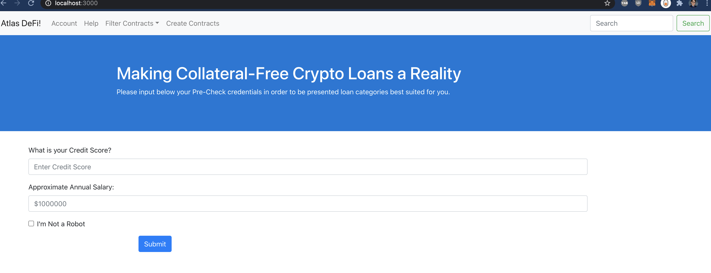
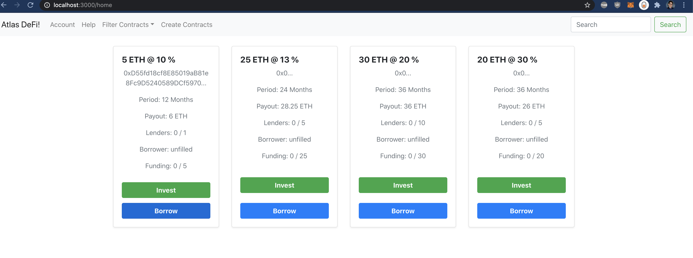
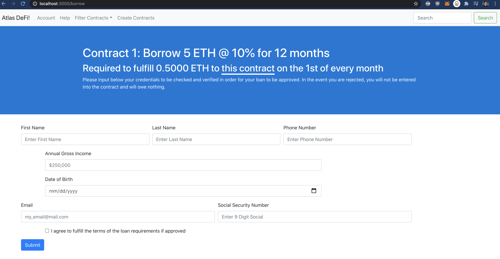

# atlas-defi: Description
Atlas is a decentralized cryptocurrency loan platform for executing transfers without requiring large amounts of cryptocurrency as collateral from the borrower. Anonymous distributed nodes can decide which loan contracts suit their needs (based on interest, time of payouts, credibility of the borrower, etc.), and choose contracts based on which third-party verifier meets their criteria.

Currently, the project operates on a local ganache chain. While deploying the contracts to mainnet and having all operations run on publicly accessible URLs is under development, the steps to reproduce the project are outlined below. 
## Run Instructions for Client Application Local Setup
1. Ensure Node and React are installed on local machine. Clone the Atlas-Frontend Repo
2. Run ```npm install``` in the root of the project directory to install local dependencies
3. In terminal 1, run ```npm start``` to launch the react server. 
4. Use terminal 2 to ``truffle compile``, ``truffle test``, and ``truffle migrate`` your smart contracts. Ensure a local Ganache instance is running on port :8545 as well before running the truffle commands.
5. Take the URL result from step 5 below, and paste the base URL (either http or https) returned from the ngrok terminal into line 66 of "LoanContract.sol" of the ``$...atlas-frontend/build/contracts`` directory.
6. Next, ethereum-bridge must be installed for the local ethereum blockchain to be able to use the Provable oracle located in the smart contract. run ``ethereum-bridge -H localhost:8545 -a 1`` to launch your ethereum bridge, and take note of the OAR address returned upon running the command. Also read the terminal output for instructions on how to retrieve that same OAR instance for future uses of the client, if re-compilation & migration of the smart contract is not desired.
7. Take the OAR address returned, and paste only the address into line 24 of the contract above from step 5.
8. Using the directory opened from step 4, compile, test, and migrate the contract to the local Ganache chain running on port 8545. Take note of the contract ABI produced in ``$...atlas-frontend/build/contracts/LoanContract.json`` for step 9. Ensure all unit tests pass.
9. Paste the full ABI into the appropriate ABI variable in ``$...atlas-frontend/web/src/components/Interface/ABI.js`` 
10. Save and refresh the running React.js client to reset the state. The application should now run, and have basic MetaMask capabilities. Note that Ganache and MetaMask may lag at this point and values or confirmation windows may not pop up immediately, but loans should transact upon successful borrower and "loan deposit" submissions.
### Backend
1. Clone the Atlas-Backend Repo 
2. Install "ngrok" free local tunnelling service. In the ngrok install directory, run ``./ngrok authtoken {my auth token}`` after making an account and receiving your free project key.
3. Inside the root of the backend project, run ```npm install``` to install local dependencies.
4. Next, run ```node app.js``` to launch the Node/Express server.
5. Finally, run ngrok and link to the local :8080 server, so the smart contract oracle can reach the globally accessible URL. Use ``./ngrok http 8080``. Return to step 5 of the "Client Application" setup, and modify the appropriate line in the smart contract posting to the ngrok public URL.
6. In any new terminal window, start the backend database. Neo4j is the default in this project, and must be installed separately. The community edition version used for this project is v3.5.3, and can be launched via ```bin/neo4j console``` in the install directory. However, if a later version is installed, follow the step-by-step instructions on Neo4j's website for the most current instructions.


## Run Instruction Overview

For an overview of what terminal tabs you need open and the associated run commands required run the project locally, refer to the below table.

| Terminal Location              |Run Commands                          |Result                         |
|----------------|-------------------------------|-----------------------------|
|atlas-frontend/web|`'npm start'`            |React frontend is launched on localhost:3000            |
|atlas-frontend          |`truffle compile` or `truffle test` or `truffle migrate`          |Compile, test, or migrate Solidity contracts   
|atlas-backend          |  `node app.js` | Express server is launched on localhost:8080

## Atlas Interface
### Pre-Screen page 

### Suitable Contract Marketplace

### Borrower Credential Submission for Verification
